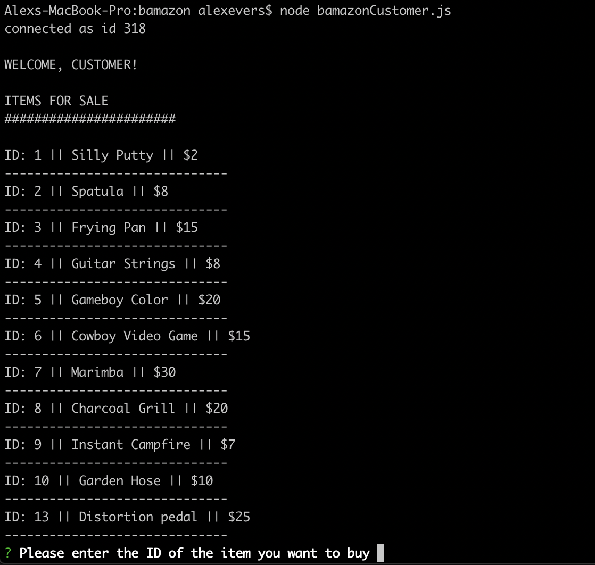
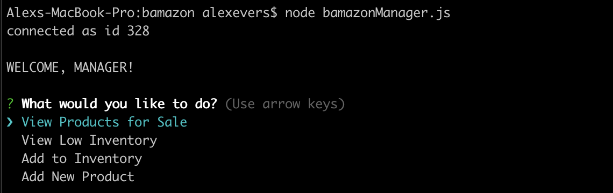
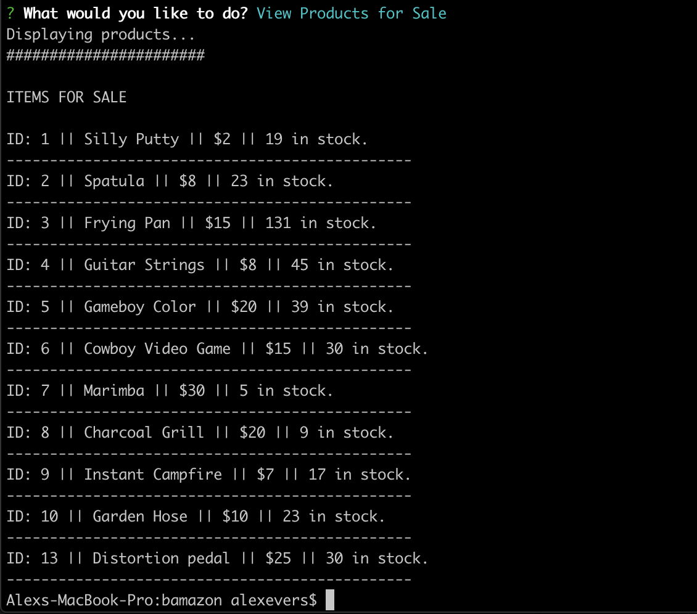
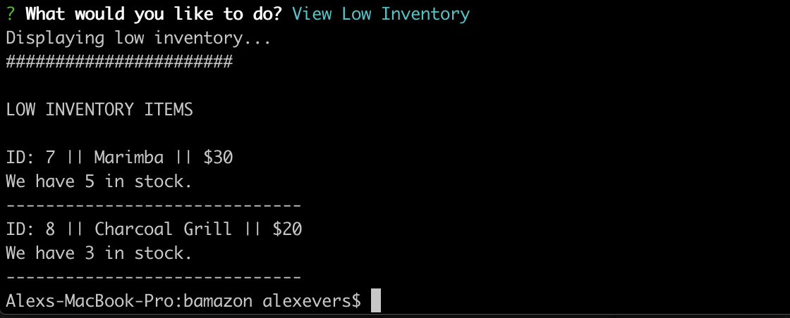
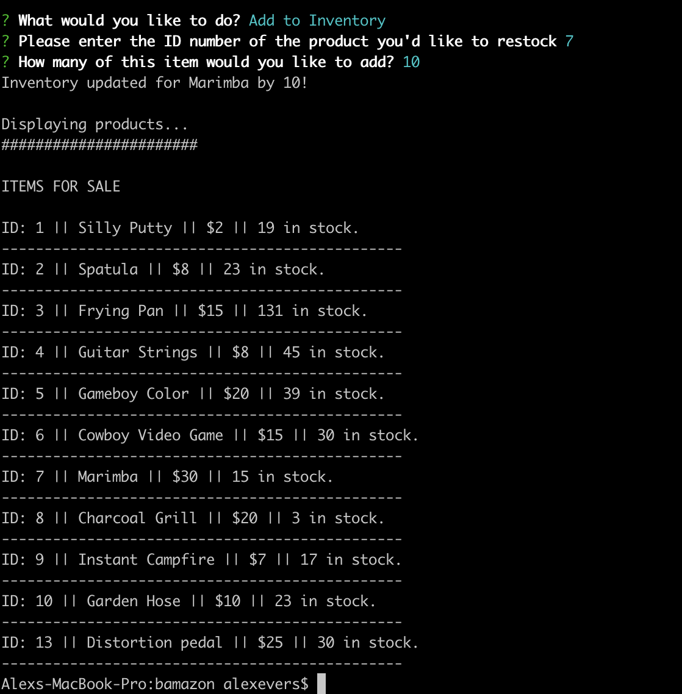
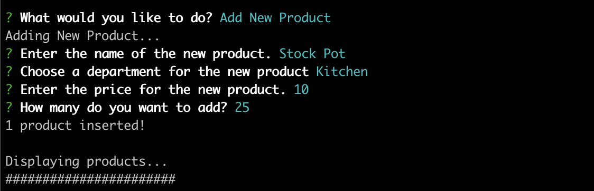
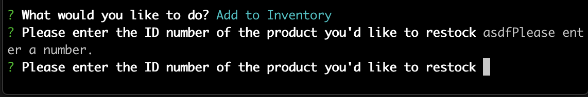

# bamazon
This is a Node-based application that tracks product inventory and sales through the use of a MySQL database. Our database contains a table of products and relevant information including Price, Department, and Quantity in stock. The application can be viewed as either a customer or a manager, with different operations and capabilities for each view.

## Customer View
The customer view can be accessed by running bamazonCustomer.js. On start, we display a welcome message, along with a list of all products for sale. This list includes each item's ID number and price. 

### Successful Order
We then use the NPM Inquirer package to ask the customer for the ID number of the item they would like to buy, as well as the quantity they'd like. Assuming we have enough inventory to cover the order, we will handle the transaction. The following things will happen:
1. The order summary, including prduct name and quantity, will be displayed.
2. The total price will be calculated and displayed to the customer.
3. The database will be updated to reflect the drop in product inventory.

### Customer Troubleshooting
The first error the application will 'catch' is an invalid input during the order placement prompt. We ask the customer for the ID number and quantity of the item, and both of these inputs need to be numbers. To ensure this has been done, we use validation blocks for each input. If a user enters anything other than a number, they will be prompted again for a number.

The other error we look for is insufficient inventory to complete a transaction. If a customer orders more of an item than we have in stock, the transaction is blocked and we print a message to the customer before returning to the menu.

## Manager View
The manager view can be accessed by running bamazonManager.js. Running the file will display a welcome message for the manager and a list of available actions, provided by Inquirer.

### View Products for Sale
This option will display all products currently for sale in the database. It's just like the list a customer would see, but this version also includes the number of each item we have in stock.

### View Low Inventory
This option displays the product table, but only includes items with fewer than 5 in stock. This is a useful view for planning restock orders.

### Add to Inventory
This option allows managers to add to the inventory of an existing product. In the previous screenshot, we saw that there were only 5 marimbas left in stock. Shown below is the process for restocking. We take in the product ID and the number to be added, and then update the database as needed. As a final step in this operation, we display the updated product list, where we can see the new inventory count.

### Add New Product
This option gives managers the ability to add new products to the database. We use Inquirer to take in the necessary product information, including Name, Price, and Starting Inventory. 

Once we have that information, we insert the product into the database and display the updated product list, which now includes the new product.

### Manager Troubleshooting
As with the customer prompts, we validate the manager's inputs to ensure we have numbers when we expect them. 

